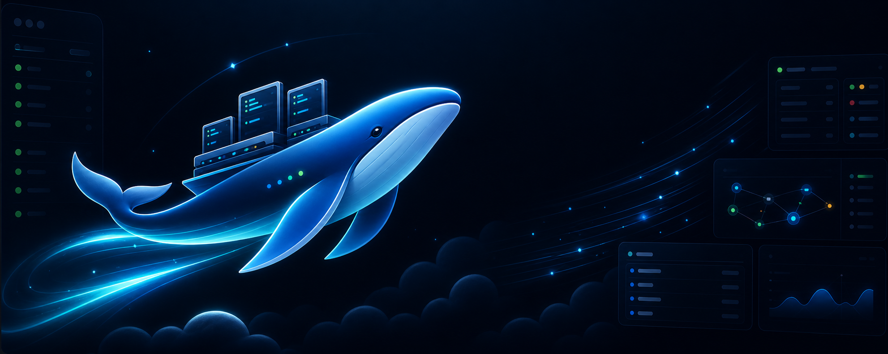

<p align="center">
  
</p>

# Haneulchi

**AI 코딩 에이전트를 위한 터미널 중심 커맨드 센터.**

Haneulchi는 여러 프로젝트, 터미널, 에이전트, 리뷰, 예산, 워크플로, 증거 패키지를 동시에 다루는 개발자를 위한 local-first 데스크톱 워크스페이스입니다. Tauri 데스크톱 셸, React 제어 화면, Rust/SQLite 상태 저장소, Unix domain socket 기반 로컬 Control API, `hc` CLI를 하나의 에이전트 운영 콘솔로 묶습니다.

[English README](./README.md)

## 왜 Haneulchi인가

AI 보조 개발은 터미널, 태스크 보드, 리뷰 증거, 워크플로 계약, 보안 승인, 비용 제어가 서로 다른 도구에 흩어질 때 빠르게 복잡해집니다. Haneulchi는 실제 작업이 일어나는 터미널 가까이에 이 모든 운영 표면을 배치합니다.

- **터미널 덱 중심 운영**: 로컬 PTY, 지속 세션, 명령 캡처, 터미널 transcript chunk, guarded input을 한 화면에서 다룹니다.
- **에이전트와 프로젝트 조율**: 프로젝트 탭, 세션 스택, skill pack, runtime pool, 태스크 보드, run queue, review queue, 외부 tracker sync를 관리합니다.
- **리뷰 증거 보존**: command block, run replay metadata, evidence pack, review decision, follow-up task, transcript summary, PR landing plan을 기록합니다.
- **위험과 비용 제어**: policy approval, secret redaction, permission audit, token usage, budget gate, cost forecast를 제공합니다.
- **Local-first 구조**: 핵심 상태는 SQLite와 로컬 artifact에 저장되며, 데스크톱 UI와 CLI가 같은 native/control API 경로를 사용합니다.

## 주요 표면

- Terminal Deck, 프로젝트 사이드바, workspace tab, compact right rail, command palette, task board, run queue, review queue, file explorer, diff preview, localhost browser preview.
- roadmap timeline과 calendar view로 cycle/module planning, initiative rollup, token/cost summary를 확인합니다.
- skill pack registry와 runtime pool summary로 durable skill pack, context pack, active workload, local/cloud session을 연결합니다.
- historical analytics chart와 dashboard widget control로 run lifecycle, evidence completeness, budget state를 점검합니다.
- visual workflow debugger와 workflow marketplace import로 runtime step과 diagnostics를 확인합니다.
- network sandbox profile과 permission audit filtering으로 보안 진단을 강화합니다.
- budget forecast와 provider price update workflow로 비용 runway를 관리합니다.
- visual harness graph canvas와 drag-to-create link로 context/tool/task 관계를 기록합니다.
- Linear, GitHub, Plane tracker sync adapter로 외부 이슈 시스템과 dry-run 동기화를 지원합니다.

## 시작하기

필수 도구:

- Node.js 22 이상
- Rust stable
- macOS 데스크톱 패키징을 사용하는 경우 macOS 환경

```sh
npm install
npm run dev
npm run tauri dev
```

검증:

```sh
npm test
npm run build
cargo test --manifest-path src-tauri/Cargo.toml
```

## 공개 저장소 정책

이 공개 저장소에는 `docs/`와 `reference/`를 포함하지 않습니다. private docs 기반 compliance 테스트는 해당 파일이 로컬에 있을 때만 실행되고, CI에서 docs가 없으면 skip됩니다. 런타임, 서비스 클라이언트, 프론트엔드, 릴리스 패키징, Rust 테스트는 docs 없이도 계속 실행됩니다.

## 보안 모델

- secret plaintext는 state snapshot이나 evidence에 노출하지 않습니다.
- 위험한 terminal input과 policy-sensitive action은 approval record를 거칩니다.
- transcript와 evidence 생성 경로는 일반적인 secret pattern을 redaction합니다.
- workflow hook과 project file operation은 workspace/path boundary를 검사합니다.
- network sandbox profile로 localhost 작업과 remote network 접근을 구분합니다.

보안 이슈는 공개 이슈가 아니라 비공개 채널로 제보해주세요. 자세한 내용은 [SECURITY.md](./SECURITY.md)를 참고하세요.

## 라이선스

MIT. [LICENSE](./LICENSE)를 참고하세요.
